# WTAK

**A standalone Wear OS client for the TAK ecosystem.** Your position, your
team, and a map — on your wrist, with no phone required.

[](LICENSE)
[](https://developer.android.com/training/wearables)
[](app/build.gradle.kts)
[](app/src/test)

WTAK is a genuine **TAK client**, not a viewer: it speaks the real wire formats
of the ecosystem — **TAK Protocol Version 1 (protobuf)** and **Cursor-on-Target
XML** — so it exchanges position with actual ATAK end-user devices over mesh SA
multicast, with TAK servers over streaming TCP or mutual TLS, and with a
**Meshtastic LoRa radio** over Bluetooth when there is no network at all.

| Map | Radar scope | Contacts |
|:---:|:---:|:---:|
| 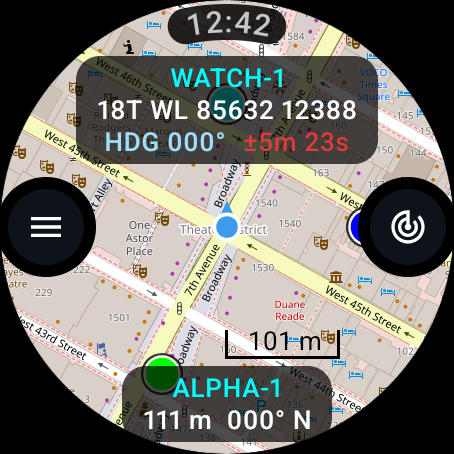 | 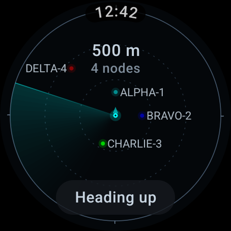 | 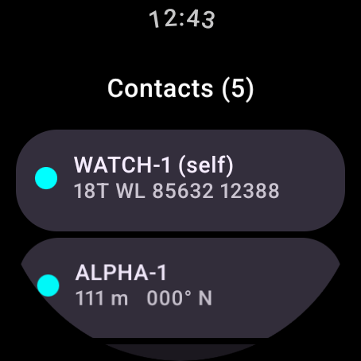 |
| MGRS, heading, fix quality. The map is cut around its controls, Wear-style. | Tile-free proximity scope: everyone by range and bearing. | Nearest first, stale contacts dimmed with their age. |

| Menu | Radio (Meshtastic) | Navigating |
|:---:|:---:|:---:|
| 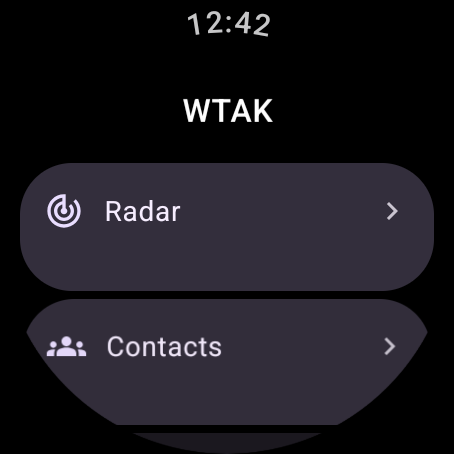 | 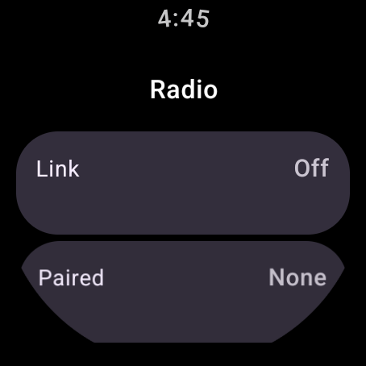 | 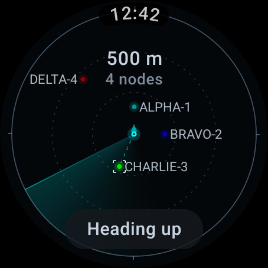 |
| Radar, contacts, GeoChat, settings. | Pair a LoRa radio and make it the TAK connector. | Long-press a contact to walk it in. |

## What it does

- **Real CoT on the wire** — self PLI as a real EUD (`ANDROID-<androidId>` uid,
  `a-f-G-U-C`, GPS-derived `ce`/`le`, battery, course/speed, `takv`), ATAK team
  colours and roles in `__group`, MIL-STD-2525 affiliation frames.
- **Three independent team links, run any or all at once** — mesh SA multicast
  (`239.2.3.1:6969`), a TAK server (plain STCP or mutual TLS with certificate
  enrollment), and a Meshtastic LoRa radio.
- **Works with nothing** — offline tile archives, a scope that needs no
  basemap, and a radio link that needs no infrastructure. Airplane-mode proven.
- **Emergency beacon** — real `b-a-o-*` alert types, so it lands in ATAK as an
  emergency rather than as a marker only this app understands.
- **GeoChat**, breadcrumb trail, waypoints, bloodhound navigation, a glanceable
  tile, and always-on ambient support.

## Get it

**[Download the latest APK](https://github.com/GPTmadeit/WTAK/releases/latest)**,
then side-load it over ADB:

```
adb connect 192.168.1.42:5555        # your watch's IP, from Developer options
adb install -r WTAK-1.8.1.apk
```

Or build it yourself — no API keys, no gated SDKs, nothing to sign up for:

```
./gradlew :app:assembleDebug
```

📖 **[Install &amp; field guide](https://gptmadeit.github.io/WTAK/)** — step-by-step
install, map and settings reference, team connectivity, TLS enrollment,
troubleshooting. (Source: [`docs/index.html`](docs/index.html).)

> **Everything on screen is real.** There is no sample or placeholder data: the
> roster contains your own GPS fix, contacts received over the network, and
> waypoints you place. An empty list means nothing has been received yet.

> **Not affiliated with the TAK Product Center**, the U.S. Government, or the
> Meshtastic project. WTAK is an independent, clean-room implementation written
> against publicly published schemas — see [NOTICE.md](NOTICE.md).

## Motion, gestures & radio configuration

### Panning a map without closing the app

Wear's back gesture is a full-screen left-to-right swipe — not an edge gesture —
and on a map that is the same movement as a pan. Getting both to coexist is
harder than it looks, because the gesture is owned by the *platform* and the
Compose nav host takes its gesture from there. Two approaches that seem obvious
are both wrong:

- `Modifier.edgeSwipeToDismiss` only constrains the nav host, so it cannot stop
  the window from dismissing.
- Setting `android:windowSwipeToDismiss=false` doesn't hand back navigation to
  the app — it removes the gesture source from **every** screen, so nothing can
  be swiped back from at all. (v1.8.0 shipped exactly this bug; it is fixed in
  v1.8.1.)

What works is to leave the platform gesture alone and exclude the map's interior
from it, which is what `setSystemGestureExclusionRects` is for:

```kotlin
mapView.systemGestureExclusionRects = listOf(Rect(edgePx, 0, width, height))
```

Back works from every screen, the map's leading 24 dp still goes back, and the
rest of the map pans.

### Verifying gestures

Gesture behaviour cannot be trusted to a casual check. Three separate rounds of
the bug above were "confirmed fixed" against a probe that was lying, so the
verification suite in this repo follows four rules:

- **Test on the right platform.** A Wear OS 4 emulator and a Wear OS 6 watch
  disagree about this gesture entirely. Use an API 36 Wear image
  (`system-images;android-36;android-wear-signed;x86_64`).
- **Assert the screen, don't infer it.** Detecting screens by pixel brightness
  called a tile-less map "not the map"; a fresh AVD sat on the onboarding screen
  while the script believed it was driving the map. Identify screens from
  `uiautomator dump`, and make every step assert the screen it expects *before*
  performing the gesture.
- **"Still in the app" is not "went back."** An assertion that only checks the
  app is still in front passes whether back worked or did nothing at all.
- **`adb input swipe` is not a finger.** It synthesises too few motion events
  for the velocity tracker: 600 ms swipes register, 150–300 ms ones often do
  not, and a swipe starting on a clickable can be claimed by it. Retry across
  profiles before believing a failure.

### Motion

Every animation resolves its curves from Wear Material 3's own
`MotionScheme.expressive()` rather than hand-picked durations, so the app moves
with the platform's weight instead of inventing its own.

- **The map is cut around its controls.** The menu and radar buttons aren't
  floated on top of the tiles — the tile layer is genuinely absent behind them,
  punched with `BlendMode.Clear` through an offscreen layer, and each cutout
  breathes open when its button is pressed. Wear shapes content around controls;
  now so does the map.
- **The scope powers on**: rings sweep outward on entry, the range animates
  between rungs instead of snapping, track-up rotation interpolates the short way
  round, and a contact joining the net grows into place with a slight overshoot
  while a lost one shrinks away.
- **Readouts transition rather than flicker** — the coordinate crossfades, the
  scope range and node count slide, and every settings value crossfades as it
  cycles.
- **The emergency banner breathes** — a slow colour and scale pulse, not a
  strobe, so it keeps pulling the eye without becoming unreadable.
- **Controls respond to touch**: buttons and list rows spring inward on press.
- **A scan looks like a scan** — expanding rings while the radio search runs, so
  a working scan is distinguishable from a hung one.

Ambient mode still renders the low-power readout with no animation at all.

### Configuring the radio as the ATAK connector

The radio screen now reads what the radio says about itself — firmware, device
role, region, modem preset and primary channel — and can set it up for TAK in
one tap:

- Device role → **TAK**, the role Meshtastic ships for this job, which
  suppresses the routine chatter a general-purpose node emits. Deliberately not
  `TAK_TRACKER`, which would make the radio emit its *own* PLI alongside the
  watch's.
- The radio's **TAKConfig team and role** are written to match the watch, so the
  operator picks a team once, on the device they can actually read.

Both are wrapped in a `begin_edit_settings` / `commit_edit_settings` pair so the
radio applies them together and reboots once.

**Region is read and reported but never written.** A radio left on `UNSET`
cannot legally transmit and looks, from the watch, exactly like a mesh with
nobody on it — so it is called out in red. Which band a radio may use is a
licensing decision belonging to whoever operates it, not something this app will
pick on their behalf.

## Radar scope & Meshtastic LoRa

Two additions that between them let the watch work with no basemap, no server,
no cell coverage and no phone.

### Proximity radar

A tile-free scope: you at the centre, everyone else plotted by range and
bearing. Reached from the target button on the map, or Menu → Radar.

| Empty scope | Team on the scope | Navigating to a contact |
|---|---|---|
| 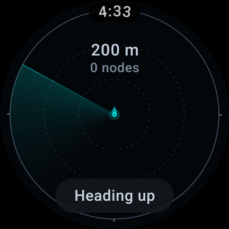 |  |  |

- **Automatic ranging** on a 1–2–5 ladder from 50 m to 50 km, sized so the
  furthest contact sits inside the outer ring with headroom instead of
  flickering on and off the rim. The crown pins it; tapping the range returns to
  automatic.
- **Sweep-painted blips** — a contact is brightest just after the arm passes it
  and fades over the revolution, never to zero. Stale contacts go hollow rather
  than disappearing, so "last known" still reads as a position.
- **Off-scope contacts** become a chevron on the rim pointing the way out — a
  bearing you can still act on beats pretending nothing is there.
- **Team colours and MIL-STD affiliations** exactly as on the map; waypoints are
  diamonds, emergencies pulse red.
- **Tap** a contact for its detail, **long-press** to navigate to it (the
  bloodhound target is shared with the map), **tap the centre** to go back,
  **tap the chip** for north-up / track-up.
- Labels are placed against a collision map that reserves the HUD's own regions,
  so a callsign never lands on the range readout or on your own marker; a label
  with nowhere clear to go is dropped rather than drawn over something.
- Always-on renders the boundary ring, your marker and nothing else.

### Meshtastic as the team link

The watch talks directly to a **Meshtastic LoRa radio over BLE** — it is the
BLE central, the radio is the transport, and there is no phone and no server in
the path. Settings → Radio.

| Radio section | Setup | Scanning |
|---|---|---|
| 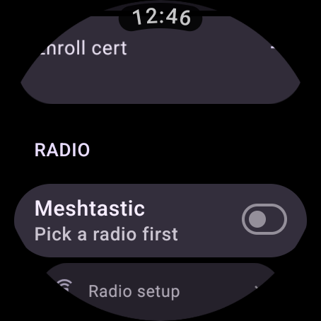 |  | 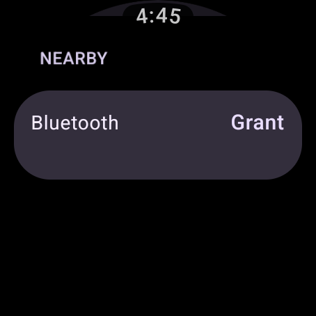 |

- Position reports and GeoChat ride **`ATAK_PLUGIN` (port 72)** as **TAK
  Packets** — the same port and payload Meshtastic's own ATAK plugin uses, so a
  watch, a phone running that plugin and any other TAK-aware node interoperate.
- **Plain Meshtastic nodes still appear**: `POSITION_APP` and `NODEINFO_APP` are
  decoded into contacts, and `TEXT_MESSAGE_APP` lands in GeoChat. A radio with
  no TAK plugin is still something on the ground worth seeing.
- **Airtime-aware pacing.** LoRa is a shared, duty-cycle-limited medium, so the
  IP transports' 3-second PLI would flood the mesh for the whole team. Position
  goes out on movement (30 m) with a 30-second floor between packets and a
  5-minute keepalive when you are stationary.
- The client protocol is the documented one: negotiate a large MTU (the default
  23-byte MTU truncates almost every real packet), subscribe to `fromNum`, write
  `want_config_id`, then drain `fromRadio` until it returns empty — and repeat
  that drain on every notification. One GATT operation at a time, everything on
  a background scope, reconnect with backoff.
- Bonding is Android's: the radio's PIN is entered in the system pairing prompt,
  never in this app.
- The protobuf codec is hand-rolled like the TAK one, and unit-tested against
  wire bytes assembled by hand from the published schemas — including the
  sfixed32 sign handling that would otherwise put a teammate in the wrong
  hemisphere, and `is_compressed` packets whose unishox2 callsigns are dropped
  rather than rendered as garbage.

### Also on the scope

- **GPS and compass are owned app-wide.** They used to belong to the map screen,
  so opening Contacts, GeoChat or the radar froze your own position while the
  transports carried on broadcasting it. Anything reading the repository now
  gets the same live fix.
- **Back-gesture fix, properly this time.** 1.6.0 restricted dismissal on the
  map with `edgeSwipeToDismiss`; because the map stays composed as the
  background of whatever you open, its verdict was still being applied to the
  screen in front of it, and leaving the map by tapping anything away from the
  left edge left the next screen impossible to swipe back from. Swipe-dismiss is
  now simply disabled for the map destination — where it only ever exited the
  app — and every other screen keeps the standard full-surface Wear back swipe.

## TLS certificate enrollment

The watch enrolls with a TAK Server the same way ATAK's Quick Connect does, then
streams CoT over **mutual TLS** — verified end-to-end on the emulator against
[`FakeEud`](tools/FakeEud.java) running a real Marti-style cert API + client-auth
TLS input:

1. `GET /Marti/api/tls/config` (HTTP Basic) → subject name entries.
2. Generate RSA-2048 key + **PKCS#10 CSR** (BouncyCastle).
3. `POST /Marti/api/tls/signClient/v2?clientUid=…&version=2` → JSON `{signedCert, ca0}`.
4. Assemble PKCS12 identity + pin the returned CA as the truststore.
5. Connect to the TLS CoT input (8089) with client-cert auth.

**Captured proof:**

```
watch  I CertEnrollment: enrolled: cert CN=watchuser, 1 CA(s) pinned
watch  I TakClient: TLS handshake OK: TLSv1.3 TLS_AES_256_GCM_SHA384, server=CN=10.0.2.2,O=FakeTAK
watch  I TakClient: connected to 10.0.2.2:8089 (mTLS)
server [enroll] POST signClient/v2 ?clientUid=ANDROID-c81bdbcadbe4eb6e&version=2 — CSR 852 chars
server [tls-cot] client connected, VERIFIED cert subject: OU=Watch,O=FakeTAK,CN=watchuser
server [tls-cot] RECEIVED over mTLS: <event … uid="ANDROID-…" …/>
```

The server ran `setNeedClientAuth(true)` — it would **reject** any client without a
CA-signed cert, so a successful handshake *is* the proof the enrolled cert works.

| TLS enrolled (Settings) |
|---|
| 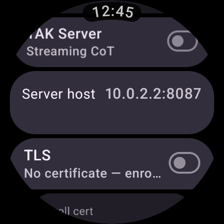 |

Try it:

```
java tools/FakeEud.java tlsserver 8446 8089 300     # Marti cert API + mTLS CoT input
# push creds, then enroll + connect over TLS:
adb push tak_server.json /sdcard/Android/data/com.atakwatch.minimap/files/tak_server.json
adb shell am start -n com.atakwatch.minimap/.MainActivity --ez enroll_now true
adb shell am start -n com.atakwatch.minimap/.MainActivity --ez enable_takserver true --ez enable_tls true
# tak_server.json: {"host":"10.0.2.2","port":8087,"tlsPort":8089,"enrollPort":8446,
#                   "username":"watchuser","password":"watchpass"}
```

Against a real server: point `tak_server.json` at your TAK Server / OpenTAKServer /
FreeTAKServer cert-enrollment endpoint (8446) with a valid username/password; the
password is used once for enrollment and never stored.

## Proven interop

Verified live on a Wear OS emulator against a fake ATAK EUD / TAK server
([`tools/FakeEud.java`](tools/FakeEud.java)) speaking the real protocols:

| Direction | Transport | Format | Evidence |
|---|---|---|---|
| Watch → TAK server | TCP (STCP 8087) | CoT XML PLI with full ATAK detail (`takv`, `contact`+endpoint, `uid Droid`, `precisionlocation`, `__group`, `status`, `track`) | Server log captured the watch's PLI verbatim |
| TAK server → watch | TCP stream | CoT XML contact ("TOC", team Dark Green, HQ) | Rendered on map + roster |
| ATAK EUD → watch | UDP mesh (239.2.3.1:6969 framing) | **TAK Protocol v1 protobuf** (`0xBF 0x01 0xBF` + `TakMessage`) | "EUD-ALPHA" (team Red) decoded, rendered at 262 m 050° NE |
| Watch → mesh | UDP multicast | TAK proto (default) or legacy XML, selectable | 247-byte proto PLIs logged every 3 s |

| Live entities: EUD-ALPHA (red, via TAK proto) + TOC (dark green, via server) | Network contacts in the roster | Full roster |
|---|---|---|
| 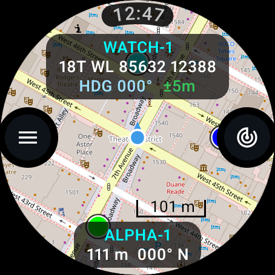 | 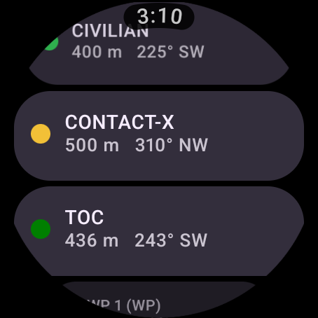 |  |

The protobuf codec is verified against the official schemas in
[`AndroidTacticalAssaultKit-CIV/commoncommo/core/impl/protobuf`](https://github.com/deptofdefense/AndroidTacticalAssaultKit-CIV/tree/main/commoncommo/core/impl/protobuf)
(`takmessage`/`cotevent`/`detail`/`contact`/`group`/`status`/`takv`/`track`), with
**6 JVM unit tests** including a golden-bytes decode of an independently
hand-encoded ATAK-shaped frame (`./gradlew :app:testDebugUnitTest`).

---

## Built for the Pixel Watch 4

| PW4 hardware / platform | What the app does with it |
|---|---|
| **Wear OS 6 (Android 16)** | `compileSdk`/`targetSdk` **36**, AGP 8.11, Material 3 Expressive |
| **456 × 456 round LTPO AMOLED** | Round-safe layout, controls off the clipped corners |
| **Always-on display** (40 h with AOD) | Ambient mode: black low-power readout, burn-in pixel shifting, low-bit aware; tiles + compass stop, GPS drops to a 30 s / 20 m cadence |
| **Rotary crown** | `rotaryScrollable` snap scrolling on every list, plus crown zoom on the map |
| **Dual-frequency L1+L5 GPS** | GPS accuracy carried into CoT `ce`/`le` straight from the fix |
| **455 mAh battery** | Event-driven GPS (no polling), cached marker bitmaps, lifecycle-scoped sensors, opt-in radios |
| **Haptics** | Confirms a waypoint drop without looking |

**Production hardening**

- **Background tracking** — a `foregroundServiceType="location"` service keeps GPS
  and CoT publishing alive with the screen off and the app backgrounded, with an
  ongoing notification and runtime `POST_NOTIFICATIONS` consent. Exactly one owner
  of the GPS and transports at a time (screen *or* service), so nothing is ever
  duplicated on the wire.
- **Minified release build** — R8 + resource shrinking takes the APK from
  **67 MB → 9.4 MB**, with keep rules for BouncyCastle, osmdroid, NGA MGRS and
  XmlPullParser. Verified by running the *release* APK: enrollment, mutual TLS
  and mesh all work minified (a classic release-only failure mode).
- **Signing** — release signing reads an untracked `keystore.properties`; no
  secrets in the repo. Copy `keystore.properties.sample` and point it at your own
  keystore.
- **Themed launcher icon** (monochrome layer) for Wear OS 6.

## GeoChat & range rings

**GeoChat.** Real ATAK chat (`b-t-f` with a `__chat` detail and `<remarks>` body),
broadcast to *All Chat Rooms* so ATAK clients and TAK servers see it natively.
Sending is voice-first — dictation is the only realistic way to compose on a
wrist — with quick phrases (*Roger*, *In position*, *Need assistance*…) for when
speaking isn't an option. The menu badges unread.

**Range rings.** ATAK-style distance reference at 100 / 250 / 500 / 1000 m around
your own position. Settings → *Range rings*.

**Back gesture fixed.** Swipe-to-dismiss used to claim horizontal drags across the
whole screen, so panning the map west-to-east backed you out of the app. It is now
confined to a 24 dp strip at the left edge — matching the system back target — and
the rest of the map is free to pan.

**Transports hoisted to app scope.** They used to live in the map screen's
composition, which meant opening Contacts or Settings tore down the mesh and
server connection: you silently stopped sharing position the moment you looked at
anything else. They now live above the navigation graph.

| Menu | GeoChat |
|---|---|
|  | 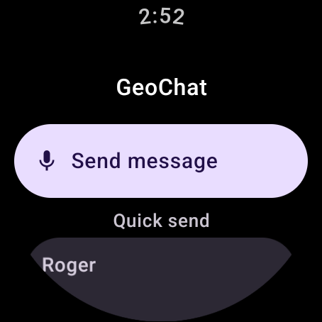 |

## Tile, trail & emergency beacon

**Glanceable tile.** One swipe from the watch face: callsign, position, fix
accuracy and nearest contact — without opening the app. Tapping it opens the
map. Because the system renders tiles when the app process is usually dead, the
tile reads a small on-disk snapshot and **always shows how old that reading is**.
A position you can't date is a position you can't use.

**Breadcrumb trail.** Your track draws itself on the map as you move, for
backtracking. Points are only kept after ~12 m of real movement, so standing
still doesn't fill the buffer with GPS jitter, and the trail is a 500-point ring
— the oldest point drops so it always shows the most recent stretch instead of
stopping dead when full.

**Emergency beacon.** Hold the menu button to raise a **911 Alert**; tap the red
banner to stand down. These are the real ATAK alert types
(`b-a-o-tbl` / `b-a-o-pan` / `b-a-o-opn`, cancelled with `b-a-o-can`) carrying an
`<emergency>` detail element, so the alert appears as a genuine emergency on
every ATAK client and TAK server on the network — not a custom marker only this
app understands. While active it re-broadcasts every 10 s so it can't be missed
or silently expire, and cancelling transmits an explicit stand-down rather than
just going quiet.

Raising is a *hold* and cancelling is a *tap*, deliberately: a real alert should
be hard to trigger by accident, a false one easy to stop.

| Emergency beacon | Breadcrumb trail |
|---|---|
| 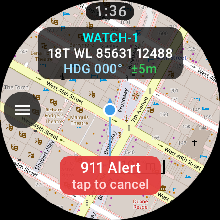 | 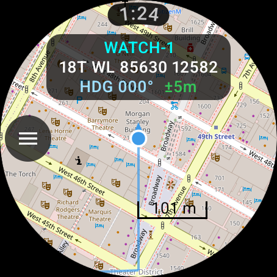 |

## Release & updates

Version history lives on
**[Releases](https://github.com/GPTmadeit/WTAK/releases)** — each entry has the
signed APK and what changed. [`RELEASE.md`](RELEASE.md) covers the process. The
short version:

- **Updates install over the previous version** — verified on device by
  installing `versionCode` 13 on top of 12 with no uninstall: settings,
  waypoints and the enrolled certificate all survived, and the user was not sent
  back through first-run setup.
- **The signing key is the thing you cannot lose.** Android only accepts an
  update signed with the same key; without it users must uninstall and lose
  their data. `keystore.properties` and `*.jks` stay out of git.
- **Adding a setting?** Give it a default that is right for someone *upgrading*,
  not just a fresh install — see the `onboarded` note in RELEASE.md.
- Backup is disabled and the adb debug hooks are compiled out of release builds,
  because the app holds an enrolled client certificate and private key.

## EUD phone bridge & onboarding

The watch is a standalone TAK client, but when you already carry an EUD running
ATAK, configuring the same operator twice is wasted work — and a 1.4" screen is
the worst place to type a callsign. So the watch can **onboard itself from the
phone**.

| First run | No phone present |
|---|---|
| 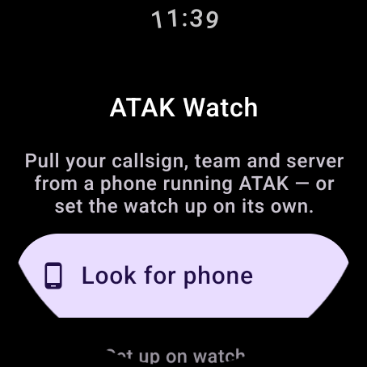 | 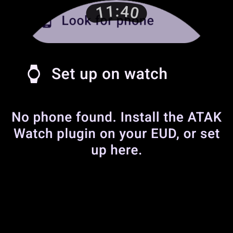 |

**Set up from phone** reads the identity the operator already configured in
ATAK — straight from ATAK's own preference keys, so the two can't drift apart:

| ATAK preference | ATAK UI | Becomes |
|---|---|---|
| `locationCallsign` | My Callsign | Watch callsign |
| `locationTeam` | My Team | Team colour |
| `atakRoleType` | My Role | Team role |
| `locationUnitType` | My Display Type | Self CoT type → affiliation |

The phone also **relays CoT** it has already received, so the watch can show the
team picture without running its own mesh or server connection — a large saving
on a 455 mAh battery.

Transport is the Wearable Data Layer, split by what each part is good at:
`DataClient` for identity (persists and re-syncs, so a watch that was off still
onboards) and `MessageClient` for live CoT (fire-and-forget, low latency). The
contract lives in
[`EudProtocol.kt`](app/src/main/java/com/atakwatch/minimap/bridge/EudProtocol.kt).

**Phone side:** [`atak-plugin/`](atak-plugin/) contains the complete ATAK plugin
source. It does **not** build with this project — ATAK plugins compile against
the SDK from [tak.gov](https://tak.gov), which requires registration and isn't on
Maven. The README there has the drop-in steps.

**No phone, no problem.** Choose *Set up on watch* and everything still works:
own mesh, own server connection, own certificate enrolment. Settings →
**Sync from phone** re-pulls later, e.g. after changing your callsign in ATAK.

## Navigation & situational awareness

**Bloodhound** — open any contact or waypoint and tap **Navigate to**. The map
draws a dashed line from you to it and the bottom pill reports range and bearing
to *that* target continuously (prefixed `›`) instead of whatever happens to be
nearest, until you tap **Stop navigating**. The target clears itself
automatically if the entity is deleted or goes stale.

**Scale bar** — a distance scale sits above the bottom pill, switching between
metric and imperial with the Units setting.

**Link status** — if TAK Server is on but not connected, a `LINK…` / `NO LINK`
badge appears top-right. Nothing shows while the link is healthy, so the badge
always means something.

**Waypoint rename** — waypoints can be renamed from their detail screen via the
watch keyboard or voice, keeping their uid so an active nav target survives.

| Bloodhound to a target | Entity actions |
|---|---|
| 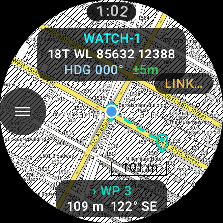 | 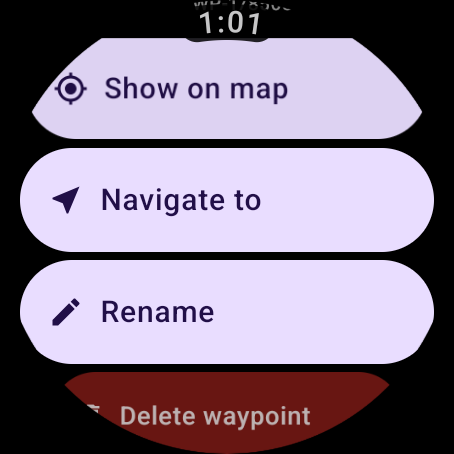 |

## Gesture-driven interface

A 454 px round screen has no room for a button grid, so the map has **one**
button — the menu — and everything else is a gesture:

| Gesture | Does |
|---|---|
| **Long-press the map** | Drops a waypoint **at that point** (not just at your position) and shares it |
| **Tap a marker** | Opens that contact's full CoT detail |
| **Rotary crown** | Zooms the map; scrolls every list |
| **Pinch / double-tap** | Zoom |
| **Tap the top pill** | Recenters on you |
| **Tap the bottom pill** | Opens the nearest contact's detail |
| **Swipe from left edge** | Back |

A one-time hint on first launch names the three non-obvious gestures, then
disappears for good.

Settings are grouped into **Identity / Display / Power / Network / App** with
real Material 3 switches, and each switch carries its live state underneath —
mesh shows `239.2.3.1:6969`, TAK Server shows its host, TLS shows whether a
certificate is held.

## Run a live demo

One command brings up a visible Wear OS emulator, installs the app, enables CoT
mesh, then walks your position along a track while a second callsign transmits
real TAK Protocol v1 position reports over the mesh:

```
powershell -ExecutionPolicy Bypass -File scripts\demo.ps1
```

Everything on screen is genuine app behaviour — there is no sample data in the
app. Your marker moves, **BRAVO-2** appears in the roster with live range and
bearing, and if the reports stop it visibly ages and turns red.

While it runs, drive the watch with the mouse: rotary crown / **+ −** to zoom,
**⚑** to drop a waypoint, **☰ → Contacts** to open the roster, tap a contact for
its full CoT detail. `Ctrl-C` stops the walk and leaves the emulator up.

| Option | Default | |
|---|---|---|
| `-Lat` / `-Lon` | Times Square | Where the demo starts |
| `-Steps` | 40 | Moves before the track loops |
| `-DelayMs` | 1500 | Pace of the walk |
| `-SkipBuild` | off | Reuse the APK already built |
| `-Headless` | off | No emulator window (for testing the script) |

Needs the `atak_watch` AVD (see below) and `java` on PATH for the teammate;
without Java the demo still runs, just with your own position moving.

**Demoing on a real watch instead?** Install the APK, put the watch and your
computer on the same Wi-Fi, and run `java tools/FakeEud.java inject 239.2.3.1`
to transmit onto the actual TAK mesh group — or just enable CoT mesh next to a
device running ATAK.

## Offline maps

The map works with **no network at all**. Drop tile archives into the app's
maps folder and select **Map → Offline**:

```
adb shell mkdir -p /sdcard/Android/data/com.atakwatch.minimap/files/maps
adb push area.mbtiles /sdcard/Android/data/com.atakwatch.minimap/files/maps/
```

`.mbtiles`, `.sqlite`, `.gemf` and `.zip` archives are supported (MOBAC, QGIS,
`mbutil`). The settings row reports what it found — `Offline · 1 file`, or
`none found` in red so a blank map is never a mystery.

Need an archive to test with? [`tools/make_test_mbtiles.py`](tools/make_test_mbtiles.py)
generates a valid one with no dependencies:

```
python tools/make_test_mbtiles.py area.mbtiles --lat 40.758 --lon -73.9855
```

| Rendering from a local archive in airplane mode | Map source |
|---|---|
| 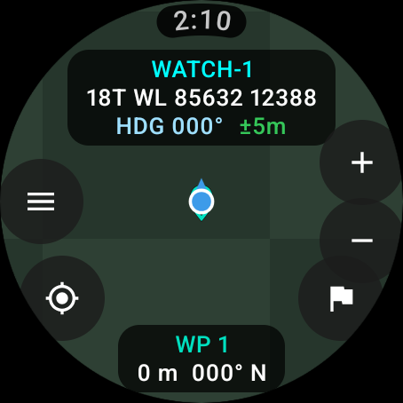 | 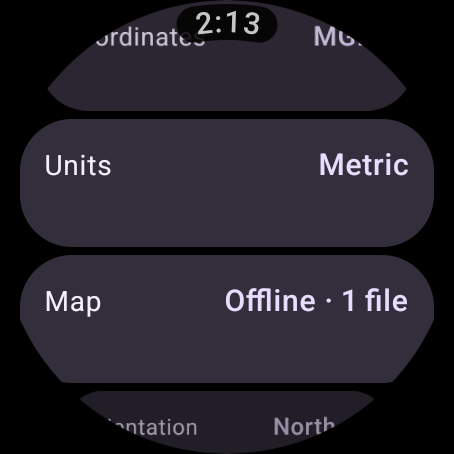 |

**Verified with the emulator in airplane mode** — tiles, position, MGRS and
heading all continue working with the radio off.

## Screens

All captured live on a Wear OS emulator (v0.5.1), with mesh + TAK server active:

**Map & roster**

| Map (MGRS HUD, heading, waypoint) | Menu | Contacts |
|---|---|---|
|  |  |  |

| Network contacts (range/bearing) | Waypoints in roster |
|---|---|
|  | 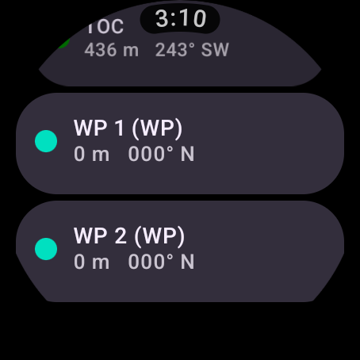 |

| Entity detail (full CoT) | Waypoint actions |
|---|---|
| 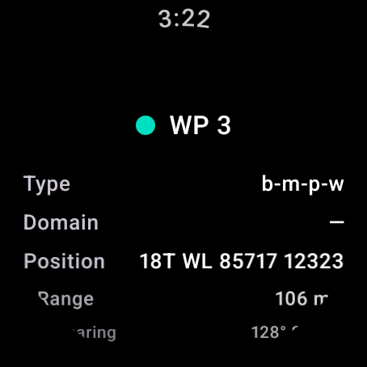 | 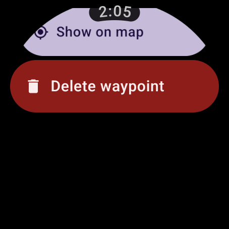 |

**Settings** — every section, all persisted

| Callsign & affiliation | Team & role (ATAK identity) | Coordinates & units |
|---|---|---|
| 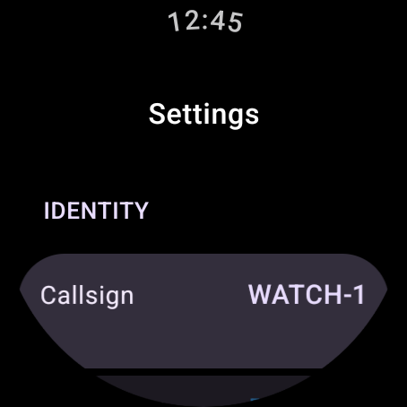 | 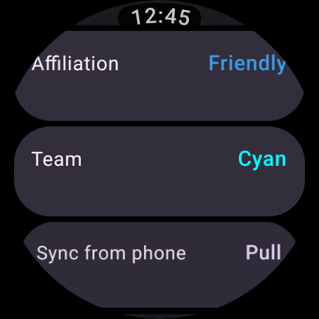 | 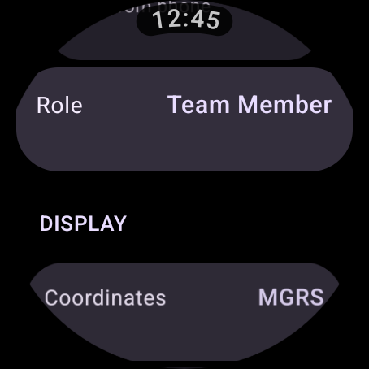 |

| Map & orientation | Display & follow | Background tracking (v0.6.0) |
|---|---|---|
|  | 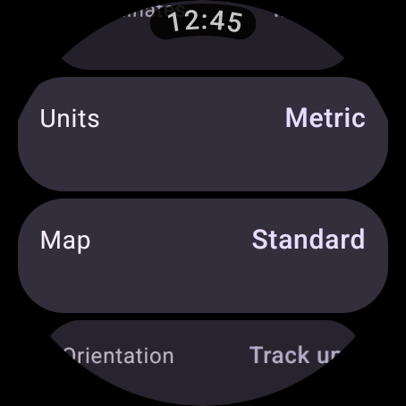 | 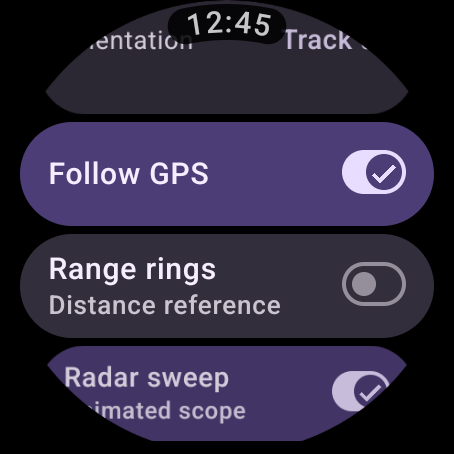 |

| Mesh & wire format | TAK Server & host | TLS + enrollment |
|---|---|---|
| 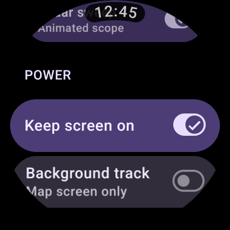 | 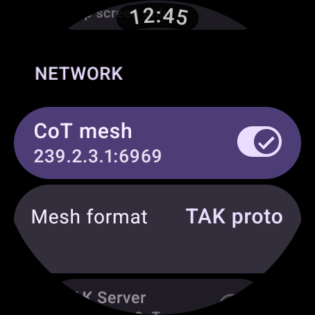 |  |

| Radar scope | Radio (Meshtastic) |
|---|---|
|  |  |

**About** — version and the live CoT XML this watch is emitting

| About | Self CoT event (wire format) |
|---|---|
| 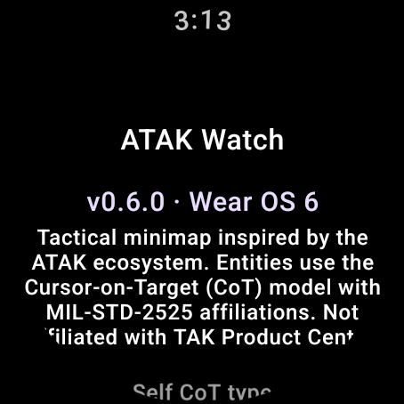 | 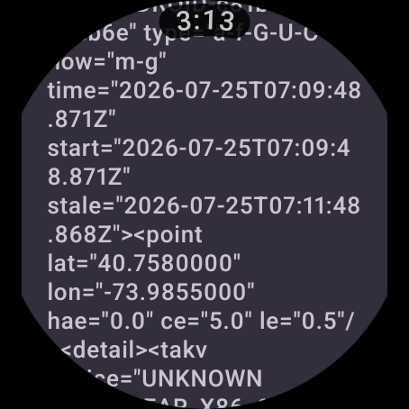 |

> The **ambient / always-on** screen isn't pictured: the Wear emulator won't enter
> a real ambient transition (the platform drives it from hardware), so there is no
> honest screenshot to take. The code path is implemented and the app is bound to
> the system ambient service — verify it on a physical watch.

## Feature set

- **Self PLI like a real EUD** — `ANDROID-<androidId>` uid, `a-f-G-U-C` type,
  GPS-derived `ce`/`le`, battery in `status`, course/speed in `track`,
  device/OS/app in `takv`, callsign + `*:-1:stcp` endpoint in `contact`.
- **ATAK team identity** — team color (the real 14-color ATAK palette) and role
  (Team Member / Team Lead / HQ / Medic / Sniper / FO / RTO / K9) in `__group`,
  exactly the semantics real ATAK uses. Teammates render as team-color circles
  (team trumps the generic friendly frame, like ATAK); hostile/neutral/unknown
  render as MIL-STD-2525 diamond/square/quatrefoil.
- **CoT mesh SA** — TAK default group 239.2.3.1:6969; sends proto or legacy XML,
  receives both (auto-detected per packet); stale-based pruning; waypoint
  broadcast on drop.
- **Meshtastic LoRa** — TAK Packets on `ATAK_PLUGIN` (72) straight to a radio
  over BLE, plus plain Meshtastic positions, node info and text; airtime-aware
  position pacing. No server, no IP network, no phone.
- **Proximity radar** — tile-free range/bearing scope with automatic ranging,
  sweep-painted blips, rim chevrons for off-scope contacts and shared
  bloodhound targeting.
- **TAK Server client** — persistent STCP connection (XML streaming, the
  no-negotiation-required baseline every TAK server accepts), auto-reconnect
  with backoff; host configurable via `tak_server.json` (see below).
- **Map** — osmdroid tiles (standard/topo), compass heading + track-up, MGRS or
  Lat/Lon HUD, range/bearing to nearest entity, waypoints (CoT `b-m-p-w`,
  persisted), rotary-crown zoom, follow-GPS, recenter.
- **Efficiency** — event-driven GPS (no polling), cached marker bitmaps,
  incremental by-uid marker diffing, lifecycle-scoped sensors, opt-in radios.
- **Motion** — Wear Material 3 `MotionScheme.expressive()` throughout; the map
  is cut around its edge controls rather than having them laid on top; nothing
  animates in ambient.

## Not claimed (honest limits)

- **Not an ATAK plugin** — plugins load inside ATAK on a phone; this is a
  standalone TAK client for Wear OS.
- **Enrollment uses trust-on-first-use** for the enrollment HTTPS call (the
  server CA isn't known until it's returned) — same as ATAK Quick Connect. Every
  later CoT connection is pinned to the enrolled CA. No hostname verification on
  the CoT socket (TAK connects by IP, trust is anchored to the CA — ATAK's posture).
- **No proto negotiation on streams** — the stream stays XML (universally
  accepted); mesh sends/receives proto natively.
- **No data packages** — PLI, points and GeoChat; no file transfer.
- Emulator NAT can't carry real multicast; mesh interop was proven by injecting
  genuine frames over UDP loopback. On real Wi-Fi hardware the same bytes ride
  the actual multicast group.
- **The Meshtastic link has not been run against a physical radio.** The
  emulator has no LoRa hardware to pair with, so what is verified is the wire
  format (unit tests over bytes assembled by hand from the published schemas),
  the BLE state machine's construction, and that the UI degrades honestly with
  no adapter and no permission. Treat the first connection to real hardware as
  the acceptance test; `MeshtasticLink` logs each stage under the tag
  `MeshtasticLink`.
- **Meshtastic strings are sent uncompressed.** The `is_compressed` form uses a
  shared unishox2 dictionary this app doesn't carry: outbound callsigns are
  plain (a few bytes larger, readable by every client), and inbound compressed
  callsigns are dropped in favour of the node id rather than shown as garbage.
  Positions in those packets are unaffected and still plotted.

---

## Interop testing with FakeEud (no ATAK install needed)

[`tools/FakeEud.java`](tools/FakeEud.java) is a zero-dependency stand-in for an
ATAK EUD / TAK server (JDK 11+):

```
java tools/FakeEud.java server 8087 300   # fake TAK-server STCP input: prints the
                                          # watch's PLIs, pushes a "TOC" contact
java tools/FakeEud.java inject            # fires TAK proto v1 mesh PLIs at UDP :6969
java tools/FakeEud.java dump pli.bin      # writes one mesh frame to a file
```

**Emulator quick-start** (the watch reaches the host as `10.0.2.2`, the default
server host in Settings):

```
adb shell am start -n com.atakwatch.minimap/.MainActivity --ez enable_mesh true --ez enable_takserver true
```

Emulator NAT drops UDP redirects on some versions; inject via guest loopback:

```
java tools/FakeEud.java dump pli.bin
adb push pli.bin /data/local/tmp/pli.bin
adb shell "cat /data/local/tmp/pli.bin | nc -u -q 1 127.0.0.1 6969"
```

**Real TAK server:** push a config and tap **Settings → Server host** to load it:

```
adb push tak_server.json /sdcard/Android/data/com.atakwatch.minimap/files/tak_server.json
# {"host": "192.168.1.50", "port": 8087}
```

**Real ATAK phone on the same Wi-Fi:** enable **CoT mesh** on the watch; ATAK's
default mesh SA (multicast 239.2.3.1:6969) will show the watch as a team member
in its team color, and teammates appear on the watch.

---

## Architecture

```
com.atakwatch.minimap
├─ ATAKWatchApp.kt          Lifecycle: settings, osmdroid, DeviceIdentity, waypoints
├─ MainActivity.kt          Compose host + debug launch extras
├─ model/                   Affiliation · Team(Color/Role) · CotType · CotEvent · Geo
├─ data/                    Settings (DataStore) · CotRepository · SelfEventFactory · WaypointStore
├─ location/LocationEngine  Single event-driven GPS source
├─ sensors/HeadingProvider  Compass (rotation vector), lifecycle-scoped
├─ net/
│  ├─ TakProtocol.kt        TAK Protocol v1 protobuf codec + CoT XML (schema-verified)
│  ├─ CotMulticast.kt       Mesh SA: proto/XML out, auto-detect in
│  ├─ TakClient.kt          TAK server client — plain STCP or mutual TLS
│  ├─ CertEnrollment.kt     Marti cert enrollment (config + CSR + signClient v2)
│  ├─ CertStore.kt          PKCS12 identity + pinned truststore + SSLContext
│  └─ DeviceIdentity        ANDROID-<id> uid + takv fields
├─ map/                     CoordinateFormatter (MGRS) · MilStdIcons (cached 2525 + team)
└─ ui/                      map / contacts / settings / menu / about (Material 3 Expressive)
```

## Build & run

Android Studio (Ladybug+), SDK 35, JDK 17, Wear OS 3+ (API 30+).

```
./gradlew :app:assembleDebug          # build
./gradlew :app:assembleRelease        # minified, signed if keystore.properties exists
./gradlew :app:testDebugUnitTest      # protocol + crypto tests (8)
powershell -ExecutionPolicy Bypass -File scripts\run-on-emulator.ps1   # one-command emulator run
```

AVD setup + Wear-emulator gotchas (charging screen, `geo fix` lon-first): see
[`scripts/run-on-emulator.ps1`](scripts/run-on-emulator.ps1).

## Roadmap

1. **Tiles + complications** — Wear surfaces for glanceable position without
   opening the app.
2. **Stream proto negotiation** (`t-x-takp-*`) and GeoChat.
3. **Phone bridge** via Wearable Data Layer to ATAK on a paired EUD.
4. **Manual .p12 import** for pre-issued certs / data-package enrollment.
5. **Route / bloodhound** navigation to a selected contact or waypoint.
6. **Gradle version catalog** + CI (lint/test on push).

> Not affiliated with, or endorsed by, the TAK Product Center or Google. Use the
> mesh/server connectivity only on networks you're authorised to operate on.
